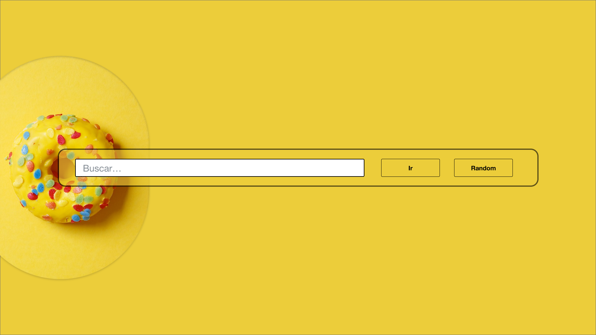
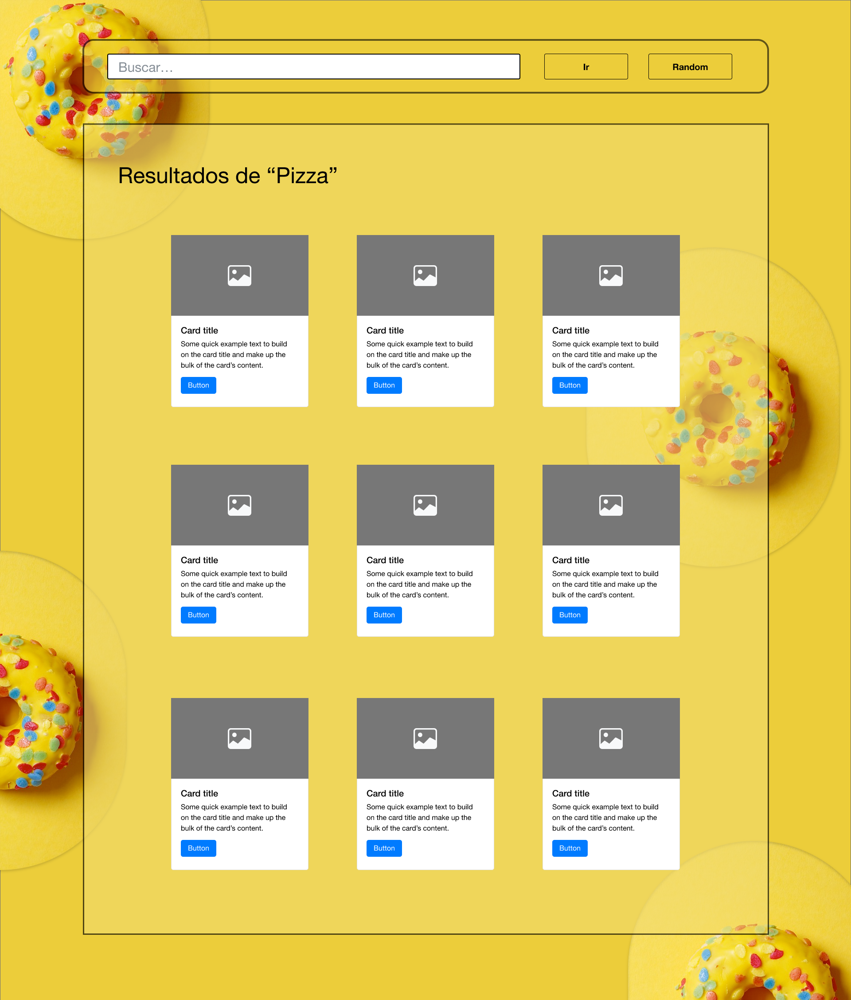
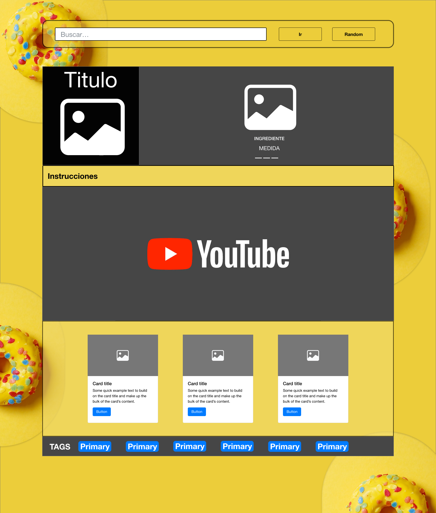

# Recetar.io

Recetar.io es una app que hace uso de la API de [TheMealDB](https://www.themealdb.com/api.php)

## Mockup

### Barra de navegación

En la barra de navegación podrás buscar las recetas de comidas o también ir de manera aleatoria al detalle de alguna receta.

### Resultados

Después de presionar el botón de **Ir** aparecerán todas las coincidencias que existen dentro de la base de datos.

### Detalle de la receta

Al presionar sobre alguna receta, se desplegarán todos los detalles de la misma.

